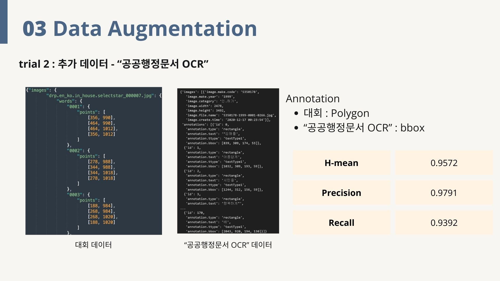

# FastCampus OCR Model Contest
## Team

|  |  |  |
| :--------------------------------------------------------------: | :--------------------------------------------------------------: | :--------------------------------------------------------------: | 
|            [진성준](https://github.com/UpstageAILab)             |            [서재현](https://github.com/UpstageAILab)             |            [이현진](https://github.com/UpstageAILab)             | 
|                            팀장, OCR Modeling, 외부 데이터                             |                            OCR Modeling, Post Processing                              |                            OCR Modeling, Backbone 탐색                             | 

## 0. Overview
### Environment

- Python==3.10.13
- Ubuntu==20.04.6 LTS

### Requirements
- albumentations==1.3.1
- autopep8==2.0.4
- better-exceptions==0.3.3
- easydict==1.11
- editdistance==0.6.2
- flake8==6.1.0
- huggingface-hub==0.19.4
- hydra-core==1.3.2
- imageio==2.33.0
- lightning==2.1.3
- pytorch-lightning==2.1.3
- matplotlib==3.8.2
- numpy==1.26.2
- numba==0.58.1
- opencv-python==4.8.1.78
- pandas==2.1.4
- pathlib==1.0.1
- Pillow==10.1.0
- Polygon3==3.0.9.1
- pyclipper==1.3.0.post5
- PyYAML==6.0.1
- safetensors==0.4.1
- setuptools==69.0.3
- scikit-image==0.22.0
- scikit-learn==1.3.2
- scipy==1.11.4
- seaborn==0.13.0
- shapely==2.0.2
- tensorboard==2.15.1
- tensorboard-data-server==0.7.2
- timm==0.9.12
- torchmetrics==1.2.1
- tqdm==4.66.1
- wandb==0.16.1
- --extra-index-url https://download.pytorch.org/whl/cu118
- torch==2.1.2+cu118
- --extra-index-url https://download.pytorch.org/whl/cu118
- torchvision==0.16.2+cu118


## 1. Competiton Info

### Overview

- _Write competition information_

### Timeline

- April 8, 2024 - Start Date
- April 12, 2024 - First Mentoring<br>
대회 baseline에 대한 설명 및 대회 팁 확인
- April 19, 2024 - Second Mentoring<br>
대회 팁 확인<br>
Post Processing 중 Polygon 값을 True로 줄 때, 성능 향상 확인
- April 22, 2024 - Backbone Model 탐색 및 Data Augmentation 실행
- April 24, 2024 - Augraphy를 이용한 데이터 증강 완료
- April 26, 2024 - Third Mentoring<br>데이터 Aug 및 Backbone Model 변경 실험<br>
WandB 를 이용한 실험 내용 공유
- April 30, 2024 - Final Mentoring<br>Optimizer 실험 시작 (Adam, Adamp, 다양한 Scheduler)
- May 1, 2024 - 발표용 PPT 작성 완료
- May 2, 2024 - Final submission deadline

## 2. Components

### Directory

```
.
├── configs
│   ├── preset
│   │   ├── datasets
│   │   │   ├── db.yaml
│   │   │   ├── db_convnext_hj.yaml
│   │   │   ├── db_effi_hj.yaml
│   │   │   └── db_mobilenet_hj.yaml
│   │   ├── lightning_modules
│   │   │   └── base.yaml
│   │   ├── models
│   │   │   ├── decoder
│   │   │   │   ├── unet.yaml
│   │   │   │   ├── unet_convnext.yaml
│   │   │   │   ├── unet_convnext_hj.yaml
│   │   │   │   ├── unet_convnextv2.yaml
│   │   │   │   ├── unet_effi_hj.yaml
│   │   │   │   ├── unet_mobilenet_hj.yaml
│   │   │   │   └── unet_resnet50_hj.yaml
│   │   │   ├── encoder
│   │   │   │   ├── timm_backbone.yaml
│   │   │   │   ├── timm_backbone_50_hj.yaml
│   │   │   │   ├── timm_backbone_convnext_hj.yaml
│   │   │   │   ├── timm_backbone_effi_hj.yaml
│   │   │   │   ├── timm_backbone_mobilenet_hj.yaml
│   │   │   │   ├── timm_backbone_convnext.yaml
│   │   │   │   └── timm_backbone_convnextv2.yaml
│   │   │   ├── head
│   │   │   │   └── db_head.yaml
│   │   │   ├── loss
│   │   │   │   └── db_loss.yaml
│   │   │   ├── model_convnext.yaml
│   │   │   ├── model_convnext_hj.yaml
│   │   │   ├── model_convnextv2.yaml
│   │   │   ├── model_effi_hj.yaml
│   │   │   ├── model_example.yaml
│   │   │   ├── model_mobilenet_hj.yaml
│   │   │   └── model_resnet50_hj.yaml
│   │   ├── base.yaml
│   │   ├── convnext.yaml
│   │   ├── convnext_hj.yaml
│   │   ├── convnext_v2.yaml
│   │   ├── effi_hj.yaml
│   │   ├── example.yaml
│   │   ├── mobilenet_hj.yaml
│   │   └── resnet50_hj.yaml
│   ├── predict.yaml
│   ├── test.yaml
│   └── train.yaml
├── img
│   ├── 1.png
│   ├── 2.png
│   ├── 3.png
│   └── 4.png
├── notebooks
│   ├── jsj
│   │   ├── 01.ipynb
│   │   ├── 02.ipynb
│   │   ├── 03.ipynb
│   │   ├── 04.ipynb
│   │   ├── 05.ipynb
│   │   ├── 06.ipynb
│   │   ├── augraphy01.ipynb
│   │   ├── augraphy02.ipynb
│   │   └── predict.ipynb
│   └── augraphy_sjh.ipynb
├── ocr
│   ├── datasets
│   │   ├── __init__.py
│   │   ├── base.py
│   │   ├── db_collate_fn.py
│   │   └── transforms.py
│   ├── lightning_modules
│   │   ├── callbacks
│   │   │   └── __init__.py
│   │   ├── __init__.py
│   │   └── ocr_pl.py
│   ├── metrics
│   │   ├── __init__.py
│   │   ├── box_types.py
│   │   ├── cleval_metric.py
│   │   ├── data.py
│   │   ├── eval_function.py
│   │   └── utils.py
│   ├── models
│   │   ├── decoder
│   │   │   ├── __init__.py
│   │   │   └── unet.py
│   │   ├── encoder
│   │   │   ├── __init__.py
│   │   │   └── timm_backborn.py
│   │   ├── head
│   │   │   ├── __init__.py
│   │   │   ├── db_head.py
│   │   │   └── db_postprocess.py
│   │   ├── loss
│   │   │   ├── __init__.py
│   │   │   ├── bce_loss.py
│   │   │   ├── db_loss.py
│   │   │   ├── dice_loss.py
│   │   │   └── l1_loss.py
│   │   ├── __init__.py
│   │   └── architecture.py
│   └── utils
│       ├── __init__.py
│       ├── convert_submission.py
│       ├── ocr_utils.py
│       └── __init__.py
├── presentation
│   ├── 1.jpg
│   ├── 2.jpg
│   ├── 3.jpg
│   ├── 4.jpg
│   ├── 5.jpg
│   ├── 6.jpg
│   ├── 7.jpg
│   ├── 8.jpg
│   ├── 9.jpg
│   ├── 10.jpg
│   ├── 11.jpg
│   ├── 12.jpg
│   ├── 13.jpg
│   ├── 14.jpg
│   ├── 15.jpg
│   ├── 16.jpg
│   ├── 17.jpg
│   ├── 18.jpg
│   ├── 19.jpg
│   └── 20.jpg
├── runners
│   ├── predict.py
│   ├── test.py
│   └── train.py
├── util
│   ├── jsj
│   │   ├── image_augraphing.py
│   │   └── new_doc_transform.py
│   ├── augraphy_sjh.ipynb
│   └── offline_augmentation.py
├── README_baseline.md
├── README.md
└── requirements.txt
```

## 3. Data descrption

### Dataset overview


### EDA


### Data Processing

#### Data Augmentation


#### Extra Data



#### Post Processing by Code


## 4. Modeling

### Model descrition


### Modeling Process


for more about our modeling...

<a href="https://wandb.ai/fastcampus_ocr3/projects">go to WandB page</a>

## 5. Result

### Leader Board

- Public<br>
H-Mean : 0.9805
Precision : 0.9816
Recall : 0.9797
Leaderboard : 2nd

- Private<br>
H-Mean : 0.
Precision : 0.
Recall : 0.
Leaderboard : 

### Presentation

<a href="https://github.com/UpstageAILab/upstage-ai-final-ocr3/tree/main/presentation"> https://github.com/UpstageAILab/upstage-ai-final-ocr3/tree/main/notebooks</a>

## etc

### Meeting Log

- _Insert your meeting log link like Notion or Google Docs_

### Reference

- https://hydra.cc/docs/tutorials/basic/running_your_appworking_directory/
- https://huggingface.co/timm
- https://augraphy.readthedocs.io/en/latest/doc/source/example_usage.html
- https://augraphy.readthedocs.io/en/latest/doc/source/list_of_augmentations.html
- https://albumentations.ai/docs/api_reference/augmentations/
- https://pytorch.org/docs/stable/optim.html